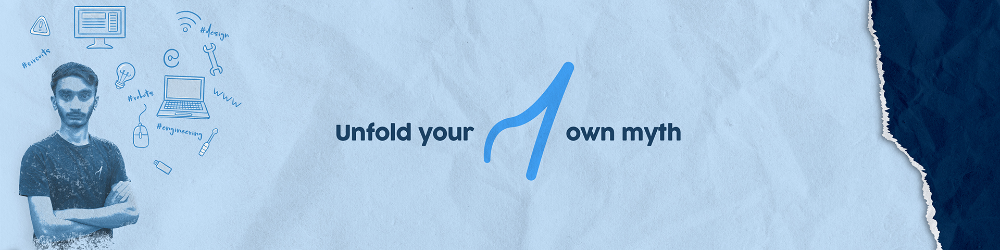

<h1 align="center">Hi 👋, I'm Umer Ghafoor</h1>
<h3 align="center">Passionate Robotic Engineer and Programmer</h3>

Asslam-o-Alaikum! I'm Umer Ghafoor, a passionate programmer with a keen interest in building desktop and Android applications. I also have a strong inclination toward programming electronics. I specialize in C++, Dart, Python, Julia, HTML, and CSS.
- 🌱 I’m currently learning **Machine Learning**
- 📃 All of my projects are available at **[GitHub](https://github.com/umerghafoor)**
- 👨‍💻 Download my Resume **[Resume](umerghafoor.pdf)**
- 📫 How to reach me **umerghaforr@gmail.com**

## Current Releases

- [Open Inventory v1.0.0](https://github.com/umerghafoor/InventorySysytem/releases/tag/v1.0.0) - Released on May 24,2023

You can find more releases on [GitHub](https://github.com/umerghafoor/InventorySysytem/releases).

<h2 align="center">Languages & Tools</h2>

	
	
	
	
	
	
	
	
	
	
	
	
	
	
	
	
	
	
  
	
	
	
	

<h2 align="center">Statistics</h2>

  

<h2 align="Center">Connect me</h2>

